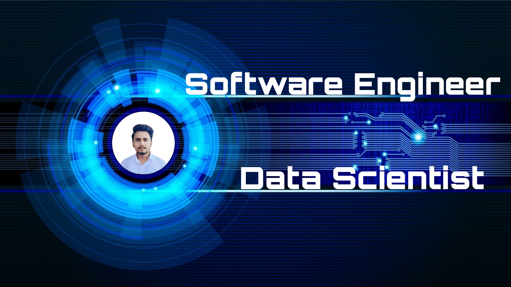

<h1 align="center">Hi 👋, I'm Ayush Kumar</h1>
<h3 align="center">A passionate Software Engineer & Aspiring Data Scientist from India</h3>

  

- ⚡ Fun fact: **I am funny 😁**  
- 🌱 Currently learning **Data Science, Machine Learning & AI**  
- 💬 Ask me about **Python, ML, AI, Django, Web Development**  
- 📫 Reach me: **ayush.kumar@example.com**  
- 🚀 Passionate about **Open Source & Projects that solve real problems**  

---

### **Connect with me:**

  
  
  
  
  

---

### **Languages & Tools**

  
  
  
  
  
  
  
  
  
  
  
  
  
  
  

---

### **Projects & Highlights**
- 📌 [Project 1: ML Model for Stock Prediction](#)  
- 📌 [Project 2: Data Visualization Dashboard](#)  
- 📌 [Project 3: Web App using Django & ML](#)  

---

### **Support Me**

---

### **GitHub Stats**

  
  

  

---

### **Fun Badges & Achievements**

  
  
  

